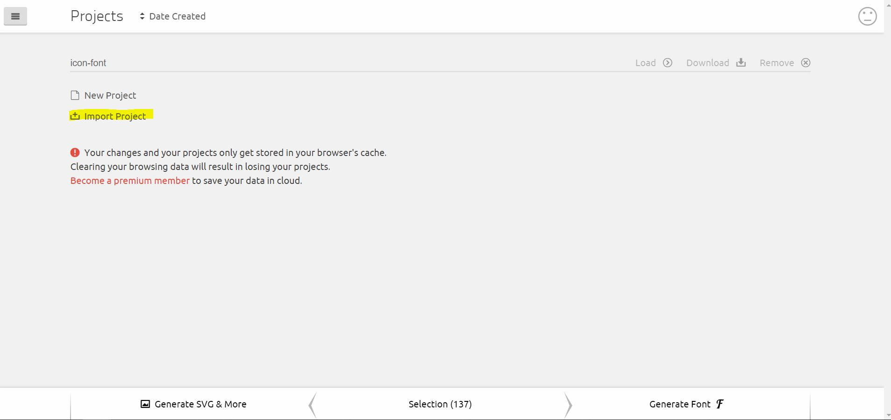
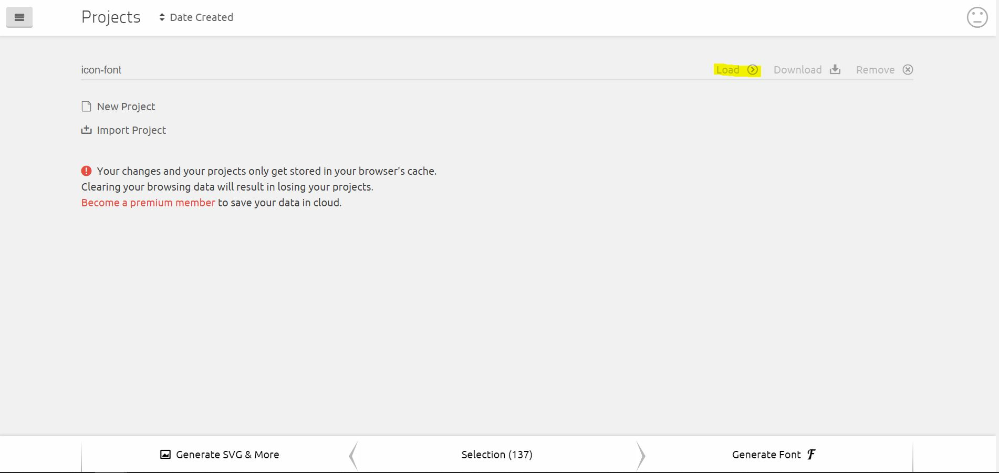
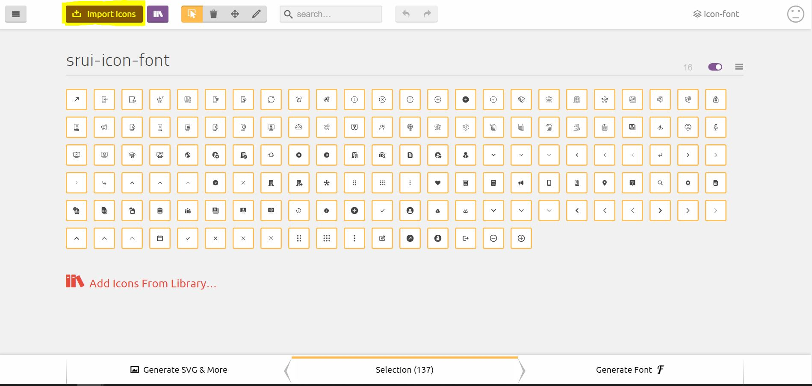
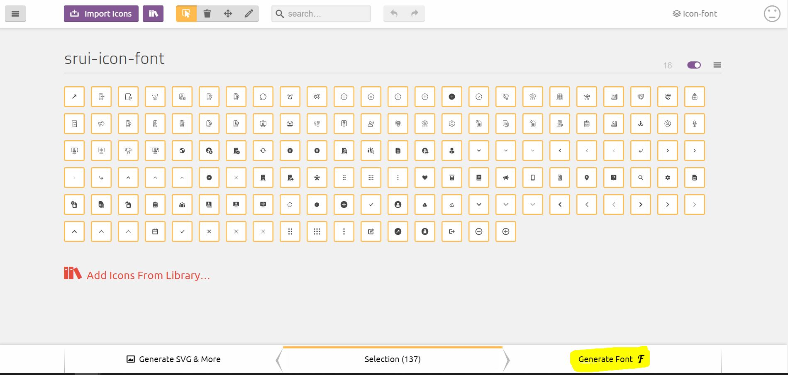
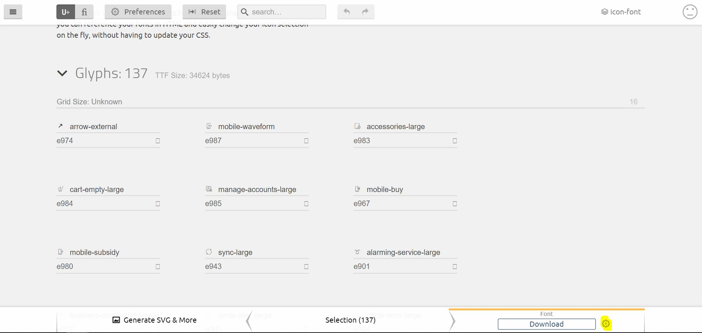

# Sunrise UI Lib - sunrise-ui #

This project has the aim to create a centralized and unified style and component library for sunrise web applications.

This is a first iteration for this project and consists on a proof of concept using HTML native web components to build this library.

Storybook is the current tool for the development of the library.

## Quick start ##

1. Clone the repo
2. Do `npm install`
3. Run storybook: `npm run storybook`

### Build a static version of the storybook / library ###

It's possible to build a static version of the library which allows to run it directly from the file system or by dropping the static files on a simple web server.

1. Do `npm run build-storybook`
2. Run it from the created dist folder (storybook-static/index.html) or serve the dist files from a web server. 

## Web components UI and Angular - NPM Local package ##

To use the web components present in this library in an Angular 8 / 9 project:

1. First, build the library by running the following in the library project root: `npm run build-lib`
2. Add the built library package (the /lib generated folder, not the main project folder) to your project as a local package: `npm install [path to local lib project]/lib`
3. Configure Angular to allow custom elements:
```javascript
import { NgModule, CUSTOM_ELEMENTS_SCHEMA } from '@angular/core';

[...]

@NgModule({

  [...]

  schemas: [ CUSTOM_ELEMENTS_SCHEMA ]
})
```
3. Import the bundled library (all components), eg:
```javascript
import 'sunrise-ui';
```
3. Or import just the component you want to use, eg:
```javascript
import 'sunrise-ui/std-button';
```
5. Global theme styles should be included in the main app component:
```
styleUrls: [
  '../../node_modules/sunrise-ui/styles/typography.css',
  '../../node_modules/sunrise-ui/styles/global-styles.css'
]
```
4. Use it in the component template, eg:
```html
<srui-std-button color="primary-color" size="default">TEST BUTTON</srui-std-button>
```

### Using web components with Angular Forms ###

To use Web components with angular forms, and to leverage angular forms API, Angular Directives can be used to provide web components the same behaviors that Angular also adds to native form inputs. More on this here: https://coryrylan.com/blog/using-web-components-in-angular-forms

#
# Update Sunrise UI Lib

1. Delete `/lib` folder if exists to avoid possible errors.
2. Checkout last changes of branch Master.
3. Update lib version on [./public/package.json](./public/package.json):
    - "version": "x.x.xx",
4. Run 
```bash
npm run build-lib
```
`/lib` folder will be created under base folder.

to create a .tgz file of the lib

1. do `cd lib`.
2. Run 
```bash
npm pack
```
and a .tzg file will be created under the folder `/lib`

#
# Update srui-icon-font
(custom icon font)

1. First of all extract the content of [srui-icon-font-v*.*.zip](./private/icomoon/) file
2. Go to https://icomoon.io/app/#/projects 
3. on the font tool page import a project 

4. Upload the selection.json file extracted from srui-icon-font-v*.*.zip
5. Load icomoon project 

6. Import the new icons(svg) 

7. after the new icons are on the set, select the new icons.

8. Generate the font 

9. Upgrade font version 

>It is ready to download the new font.


####After downloading the updated font, there’s the need to update some files on the sunrise-brandbook project.


- Copy the downloaded zip to [./private/icomoon](./private/icomoon) to keep the last srui-icon-font zip.

- Overwrite the fonts on [./public/assets/fonts/srui-icon-font](./public/assets/fonts/srui-icon-font) with the new fonts from the new font zip file content under `/fonts` .

- Update ending code of the @font-face font-family: 'srui-icon-font' in [./.storybook/preview-head.html](./.storybook/preview-head.html)
with the new font code, can be found on the file `/style.css` from the new font zip content.
```css
@font-face {
    font-family: 'srui-icon-font';
    src:  url('assets/fonts/srui-icon-font/srui-icon-font.eot?*****');
    src:  url('assets/fonts/srui-icon-font/srui-icon-font.eot?*****#iefix') format('embedded-opentype'),
    url('assets/fonts/srui-icon-font/srui-icon-font.ttf?*****') format('truetype'),
    url('assets/fonts/srui-icon-font/srui-icon-font.woff?*****') format('woff'),
    url('assets/fonts/srui-icon-font/srui-icon-font.svg?*****#srui-icon-font') format('svg');
    font-weight: normal;
    font-style: normal;
    font-display: block;
}
```
- Add new icons styles in `/style.css`, from the new font zip content, to the [icon.scss](./src/components/icon/icon.scss)
```css
.srui-icon__icon--icon-name:before {
  content: "\****";
}
```

#
# Sunrise UI supported browsers
(Storybook)

Sunrise UI is built with Custom components and widgets based on the Web Component standards and is supported by modern browsers.

###### Browsers last versions ( - 2 versions)
| Browser | | version | | support info |
|---------|---|:-------:|---|:-------------:| 
| Chrome  | |  84 - 86   | | Supported  |
| Firefox | |  80 - 82   | |  Supported   |
| Edge    | |  84 - 86  | |Supported     |
| Safari  | |  11 - 13   | |Supported     |
| Opera   | |  70 - 72  | |Supported     |
| IE      | |  ---   | | Not supported |

######Shadow DOM (V1)
| Browser | | version | | support info |
|---------|---|:-------:|---|:-------------:| 
| Chrome  | |  53 >   | | Supported  |
| Firefox | |  63 >   | |  Supported   |
| Edge    | |  70 >   | |Supported     |
| Safari  | |  10 >   | |Supported     |
| Opera   | |  40 >   | |Supported     |
| IE      | |  ---   | | Not supported |
    
######Custom Elements (V1)
| Browser | | version | | support info |
|---------|---|:-------:|---|:----------:| 
| Chrome  | |  67 >   | | Supported  |
| Firefox | |  63 >   | | Supported  |
| Edge    | |  79 >   | | Supported  |
| Safari  | |  10 >   | | Partial support  |
| Opera   | |  64 >   | | Supported  |
| IE      | |  ---   | | Not supported |

>In general:

 - Web components are supported by default in Firefox (version 63), Chrome, and Opera.
 - Safari 10 supports a number of web component features, but less than the above browsers.
 - Edge 44 (18) have partial support, in this case polyfills simulate the missing browser capabilities as closely as possible.
#
#
